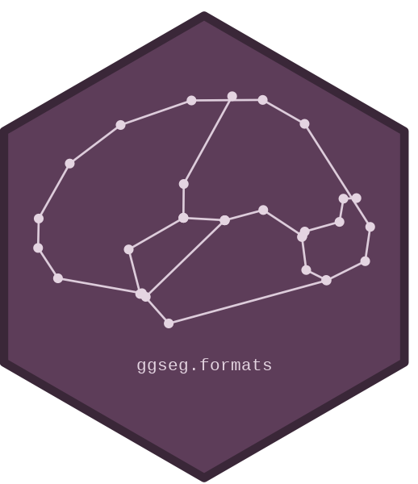
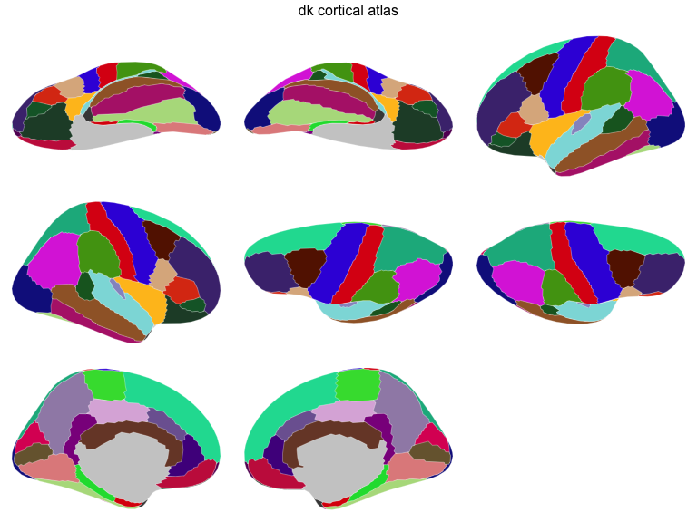
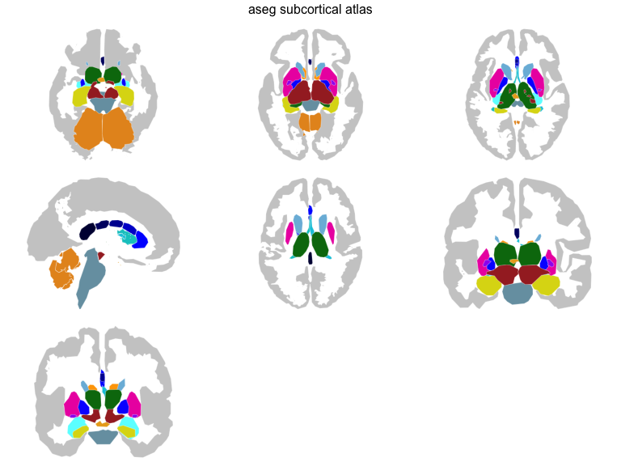
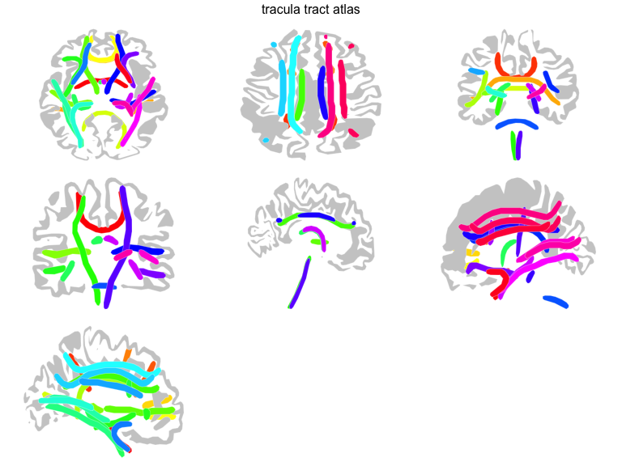
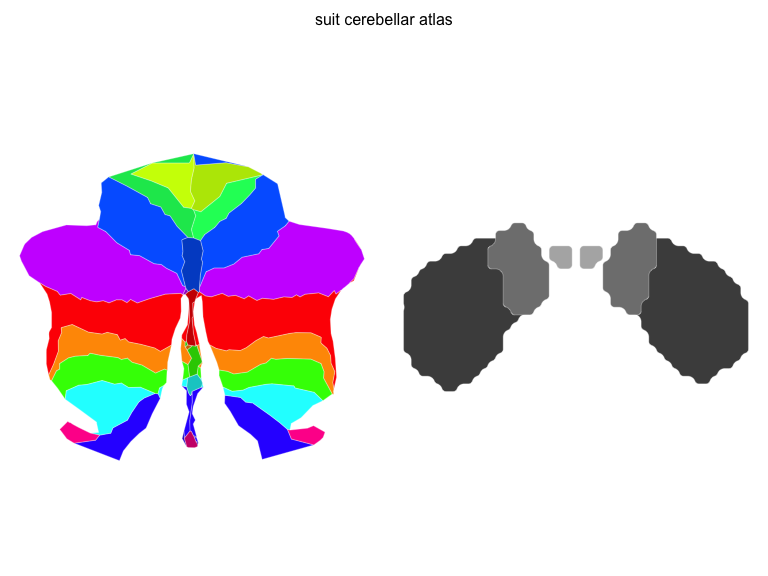
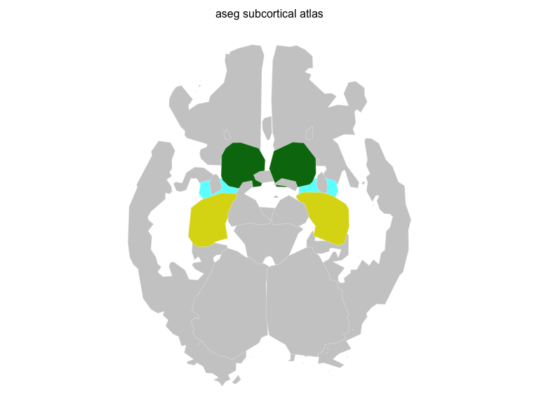

<!-- README.md is generated from README.Rmd. Please edit that file -->

# ggseg.formats 

<!-- badges: start -->

[](https://github.com/ggsegverse/ggseg.formats/actions/workflows/R-CMD-check.yaml)
[](https://github.com/ggsegverse/ggseg.formats/actions/workflows/code-quality.yaml)
[](https://github.com/ggsegverse/ggseg.formats/actions/workflows/test-coverage.yaml)
[](https://CRAN.R-project.org/package=ggseg.formats)
[](https://lifecycle.r-lib.org/articles/stages.html#experimental)
<!-- badges: end -->

ggseg.formats provides the `ggseg_atlas` S3 class that powers the
[ggsegverse](https://ggsegverse.github.io/ggseg/) ecosystem for 2D and
3D brain visualisation. It ships four bundled atlases, a set of accessor
functions for querying atlas contents, and a pipe-friendly manipulation
API for subsetting, renaming, and enriching atlas objects.

## Bundled atlases

The package includes four atlases covering the main atlas types:

- **dk** — Desikan-Killiany cortical parcellation (68 regions)
- **aseg** — FreeSurfer automatic subcortical segmentation
- **tracula** — TRACULA white matter tract atlas
- **suit** — SUIT cerebellar lobular atlas

``` r
library(ggseg.formats)
```

``` r
plot(dk())
```



``` r
plot(aseg())
```



``` r
plot(tracula())
```



``` r
plot(suit())
```



## Quick example

Atlas objects are designed for exploration and customisation. You can
query regions, filter views, and pipe operations together:

``` r
aseg_small <- aseg() |>
  atlas_region_keep("hippocampus|amygdala|thalamus") |>
  atlas_view_keep("coronal_3|axial_3") |>
  atlas_view_gather()
plot(aseg_small)
```



## Installation

Install from the ggsegverse r-universe:

``` r
options(repos = c(
    ggsegverse = 'https://ggsegverse.r-universe.dev',
    CRAN = 'https://cloud.r-project.org'))

install.packages('ggseg.formats')
```

Or install the development version from GitHub:

``` r
# install.packages("devtools")
devtools::install_github("ggsegverse/ggseg.formats")
```

## Learn more

- `vignette("ggseg.formats")` — understanding atlas structure and
  accessors
- `vignette("atlas-manipulation")` — region, view, and metadata
  manipulation
